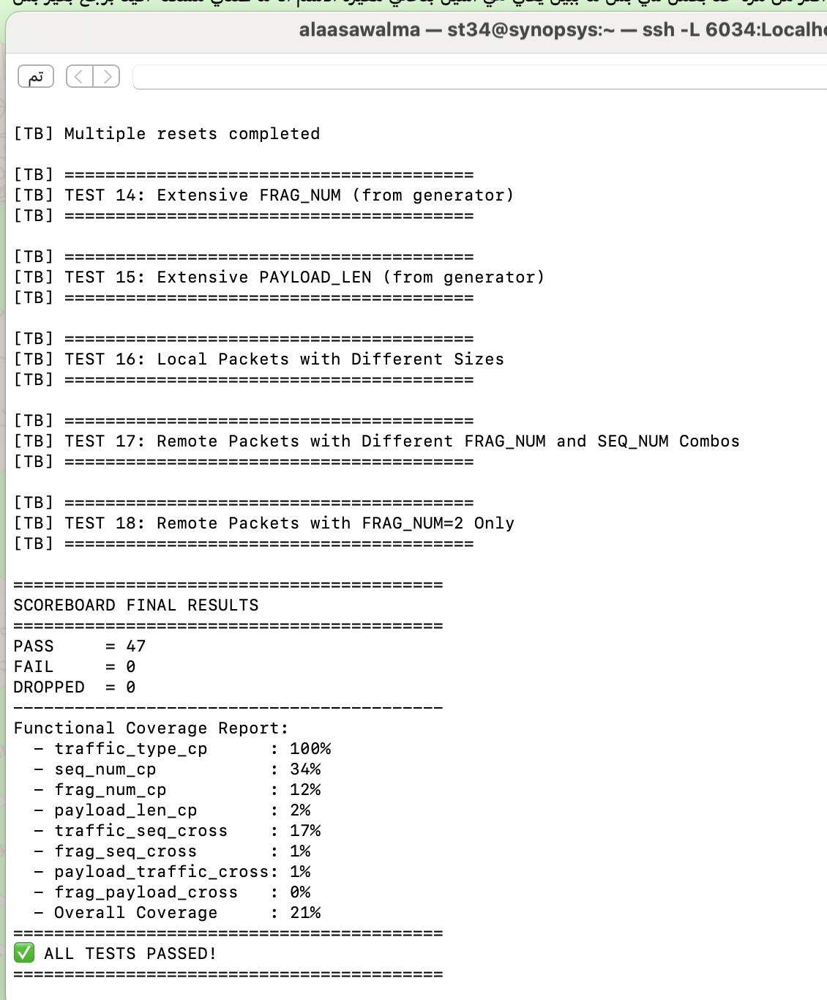
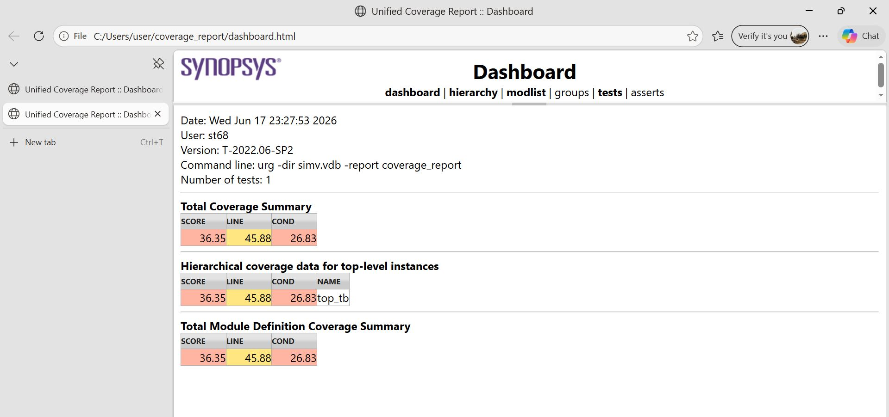

# ENCS5337 DV Project - BIRD Verification

## ✅ Simulation Results

PASS = 47

FAIL = 0

ALL TESTS PASSED

## 📊 Code Coverage Report

## 📁 Project Contents

* DUT (bird.sv)
* Testbench
* Driver
* Monitors
* Scoreboard
* Reference Model
* Functional Coverage
* Code Coverage Report
* Test Plan

